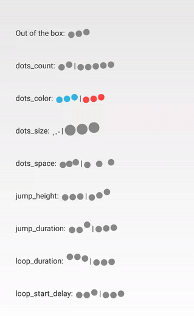

#LoadingDots for Android

Customizable bouncing dots view for smooth loading effect. Mostly used in chat bubbles to indicate the other person is typing.

##Features

 - LoadingDots animated view
 - Use in xml
 - Customize dots appearance
 - Customize animation behavior
 - Customize animation duration

##Demo



##Import

 ```xml
    compile 'com.eyalbira.loadingdots:loading-dots:1.0.2'
 ```

##Usage

For basic usage, simply add to layout xml:

 ```xml
    <com.eyalbira.loadingdots.LoadingDots
            android:layout_width="wrap_content"
            android:layout_height="wrap_content"/>
 ```

To customize, simply use the needed view attributes:

 ```xml
    <com.eyalbira.loadingdots.LoadingDots
            xmlns:app="http://schemas.android.com/apk/res-auto"
            android:layout_width="wrap_content"
            android:layout_height="wrap_content"

            app:LoadingDots_auto_play="true"

            app:LoadingDots_dots_color="@android:color/holo_blue_light"
            app:LoadingDots_dots_count="4"
            app:LoadingDots_dots_size="3dp"
            app:LoadingDots_dots_space="1dp"

            app:LoadingDots_loop_duration="800"
            app:LoadingDots_loop_start_delay="100"

            app:LoadingDots_jump_duration="200"
            app:LoadingDots_jump_height="4dp"/>
 ```
